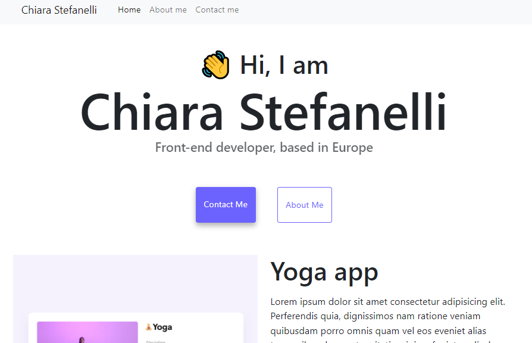

# SheCodes Responsive workshop exercise: Personal Portfolio

This is an exercise from the [SheCodes Responsive workshop](https://www.shecodes.io/responsive).
  [Verified Certificate](https://www.shecodes.io/certificates/c8c795b9043726d5311122ac2ce45a50)

Built with HTML, CSS and Bootstrap.
 Hosted on Netlify.

[Live Site URL](https://cranky-nobel-39f65f.netlify.app/).

## Screenshot

## Author
Chiara Stefanelli
 [LinkedIn](https://www.linkedin.com/in/chiarastefanelli/?locale=en_US)
